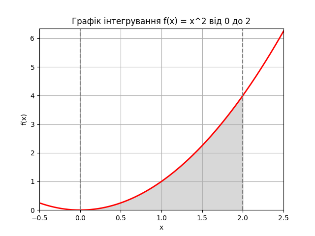

# goit-algo-hw-10

# Лінійне програмування та рандомізовані алгоритми

## Завдання 1: Оптимізація виробництва напоїв

### Умови задачі:
Компанія виробляє два види напоїв: "Лимонад" і "Фруктовий сік". Для виробництва використовуються різні інгредієнти та обмежена кількість ресурсів.

### Обмеження ресурсів:
- Вода: 100 од.
- Цукор: 50 од.
- Лимонний сік: 30 од.
- Фруктове пюре: 40 од.

### Витрати на одиницю продукції:
#### Лимонад:
- Вода: 2 од.
- Цукор: 1 од.
- Лимонний сік: 1 од.

#### Фруктовий сік:
- Вода: 1 од.
- Фруктове пюре: 2 од.

### Результати оптимізації:
- Оптимальна кількість "Лимонаду": 30.0
- Оптимальна кількість "Фруктового соку": 20.0
- Максимальна загальна кількість продуктів: 50.0

## Завдання 2: Обчислення інтеграла методом Монте-Карло

### Параметри задачі:
- Функція: f(x) = x²
- Інтервал: [0, 2]
- Метод: Монте-Карло з різною кількістю точок (N)

### Візуалізація:

### Результати обчислень:
Метод Монте-Карло:
- N = 1000: 2.688
- N = 10000: 2.6032
- N = 100000: 2.65832

### Порівняння з точним значенням:
- Результат методу quad: 2.666666666666667
- Похибка для різних N:
  * N = 1000: 0.021333 (0.80%)
  * N = 10000: 0.063467 (2.38%)
  * N = 100000: 0.008347 (0.31%)

### Висновки:

#### Оптимізація виробництва:
1. Знайдено оптимальний план виробництва:
   - 30 одиниць "Лимонаду"
   - 20 одиниць "Фруктового соку"
2. Загальна кількість продукції: 50 одиниць
3. План повністю враховує всі обмеження на ресурси
4. Використання бібліотеки PuLP дозволило ефективно розв'язати задачу лінійного програмування

#### Обчислення інтеграла:
1. Метод Монте-Карло показує різну точність залежно від кількості точок:
   - Найкращий результат при N = 100000
   - Похибка зменшується зі збільшенням кількості точок
2. Порівняння з точним значенням (2.6667) показує:
   - Висока точність при великій кількості точок
   - Метод дає прийнятні результати навіть при малих N
3. Візуалізація допомагає краще зрозуміти задачу та перевірити правильність обчислень

#### Загальні спостереження:
1. Обидва методи (лінійне програмування та Монте-Карло) є ефективними для розв'язання відповідних типів задач
2. Точність методу Монте-Карло можна регулювати кількістю точок
3. Візуалізація результатів допомагає в аналізі та валідації отриманих результатів
